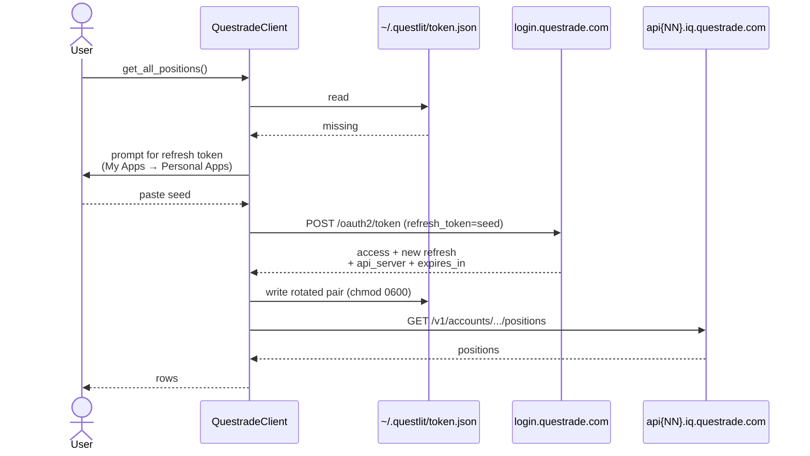
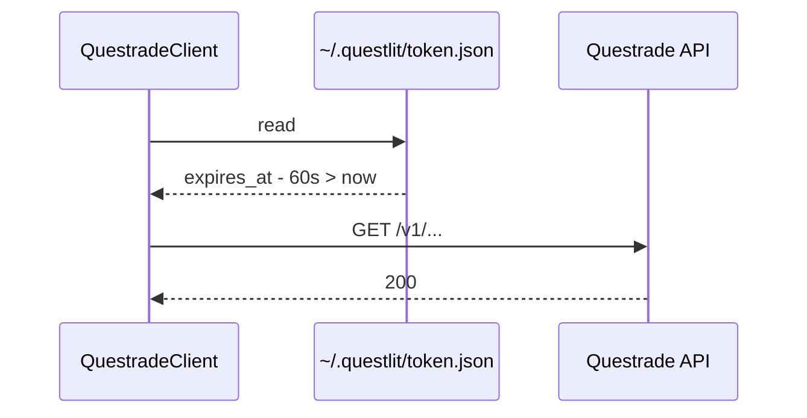
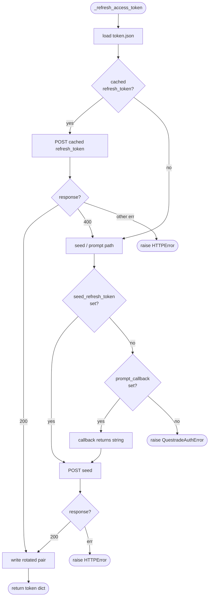
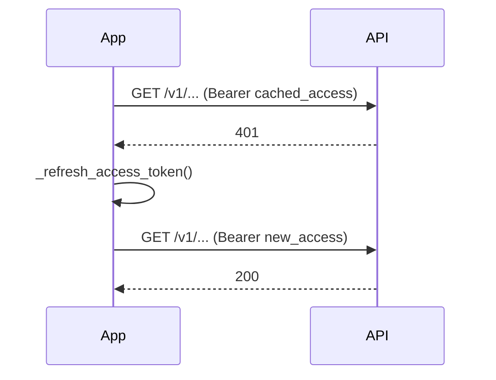

# Questrade auth — token lifecycle

How QuestLit talks to Questrade, why the credentials are tricky, and what happens when things break.

## TL;DR

QuestLit holds two short-lived tokens, both cached in `~/.questlit/token.json`:

| Token           | Typical lifetime     | Single-use? | Purpose                          |
| --------------- | -------------------- | ----------- | -------------------------------- |
| `access_token`  | ~30 minutes          | No          | Bearer token for `/v1/...` calls |
| `refresh_token` | ~7 days **idle**     | **Yes** — rotates on every redemption | Used once to mint a new pair |

The refresh token is the long-lived credential, but every redemption mints a new one **and invalidates the old one**. Persisting the rotated token to disk before returning is therefore mandatory — a crash between "Questrade gave me a new token" and "I wrote it to disk" locks the user out for good.

## Where state lives

`~/.questlit/token.json` (chmod `0600`):

```json
{
  "access_token":  "...",
  "refresh_token": "...",
  "api_server":    "https://api01.iq.questrade.com/",
  "expires_at":    1735000000.0
}
```

`api_server` is per-user (Questrade shards customers across hosts) and can change on each refresh — always read it from the response, never hard-code.

`expires_at` is the absolute epoch time the **access** token dies. The refresh token has its own server-side expiry that isn't returned in the response; you only learn it's dead by getting `400 invalid_grant` on the next refresh attempt.

## Bootstrap — first run with no cache



The seed is consumed by Questrade on this single call. If you saved that string in `.env` and also in the cache, only the on-disk copy survives — the `.env` value is now invalid forever.

## Steady state — cache is fresh



No call to the auth server — the cached `access_token` is reused until it's within 60 seconds of expiry (`REFRESH_LEEWAY_SECONDS` in `questlit/questrade.py`).

## Refresh decision tree

`_refresh_access_token` is only called when `_ensure_valid_token` decides the cached access token is stale (or doesn't exist). The flow:



The single-attempt cap on the seed path is deliberate: a typo'd seed shouldn't loop a user through unlimited prompts.

## Mid-call 401

A separate concern from refresh expiry: an access token can be revoked mid-session (e.g. Questrade rotates server-side). `_get` handles this directly:



One retry, no user interaction. If the second GET also 401s, the error propagates.

## Failure modes & recovery

| Scenario                                                | Symptom                                  | Recovery                                                                  |
| ------------------------------------------------------- | ---------------------------------------- | ------------------------------------------------------------------------- |
| Cache file deleted (or never existed)                   | `QuestradeAuthError`                     | CLI/Streamlit prompts for a fresh refresh token                           |
| >7 days idle, server-side refresh token expired         | `400 invalid_grant` → falls through to seed/prompt path | Same — paste a fresh token                                                |
| Access token revoked mid-session                        | `401` on a `/v1/...` call                | Automatic — `_get` retries once after a refresh                           |
| Bad refresh token typed at the prompt                   | `requests.HTTPError 400`                 | Re-run the command, paste the right one                                   |
| Network blip during refresh                             | `requests.HTTPError` (non-400)           | Retry the command                                                         |
| Backed up `token.json`, restored an old copy            | `400 invalid_grant` (old refresh token already rotated away) | Generate a new seed in the portal                                         |

## Where re-seeding hooks in

- **CLI** (`main.py`): `_prompt_for_refresh_token` wraps `typer.prompt(..., hide_input=True)` and is passed as `QuestradeClient(prompt_callback=...)`.
- **Streamlit** (`streamlit_app.py`): `_render_seed_form` shows an `st.text_input(type="password")`. On submit, the seed lands in `st.session_state["pending_seed"]` for one rerun, then is consumed by `QuestradeClient(seed_refresh_token=...)`. The `@st.cache_data` for `load_positions` is explicitly cleared on submit so the form can drive a fresh execution.
- **Programmatic / tests**: pass `seed_refresh_token=` to the constructor.

## Practical advice

- **Touch the API at least once a week.** Each successful refresh resets the server-side clock on the new refresh token. Going dark for >7 days breaks the chain and forces a re-seed.
- **`token_info()` does not extend anything.** It's a pure on-disk read used by the `token` CLI subcommand. Inspecting the cache won't keep it warm; only an actual API call (e.g. `get_accounts()`) does.
- **Don't share `~/.questlit/token.json`.** It contains a live bearer token. The `0600` perms enforce that on Unix; treat it like an SSH key.
- **Don't restore old backups of `token.json`.** Rotated tokens are dead the moment they're rotated. The only valid refresh token is the one currently in the file.
